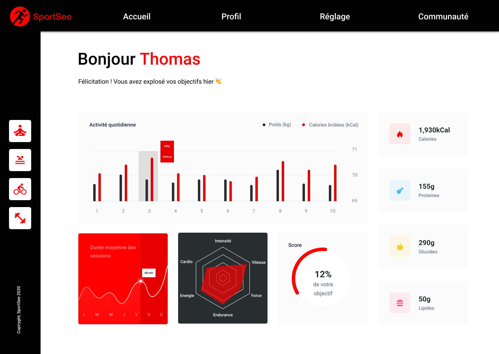

<br />
<br />
[](https://vitejs.dev)
[](https://react.dev)
[](https://recharts.org)
[](https://reactrouter.com)
<br />

As it stands, sportSee is a sports application with a functional backend that processes data and exposes four routes. One for main user data, one for retrieving session data, one for activity and one for performance. This data will be used to populate the graphs. The frontend remains to be developed, and that's precisely the purpose of this mission.

**Mission-Phase 1:** Build a modern React web app. Use the Recharts library to create graphics. You'll also need to implement a client-side routing system. Make sure you follow the model carefully; there's no need to work on the mobile and tablet versions of the project. However, the project must be readable on screens of at least 1024 x 780 pixels.
<br />

**Mission-Phase 2:** Finally, you will need to mock the data to test the data and plug in the backend to finish.

 [see the backend](https://github.com/OpenClassrooms-Student-Center/SportSee)
<br />  [see the documentation](https://drive.google.com/drive/u/0/folders/1888m3946KcI1xFF3eea-A1Ap8Jlaxirx)
<br />  [see the issues of mission](https://openclassrooms.notion.site/Tableau-de-bord-SportSee-6686aa4b5f44417881a4884c9af5669e)



<br /> 

```bash
git init
git clone https://github.com/JulienDevFront/sportSee.git
npm install
```
<br />

 **Preview of routes**
<br />

```js
GET ${this.mode.baseURL}/user/${userId}
reponse : 
    {
        "id": 12,
        "userInfos": {
            "firstName": "Karl",
            "lastName": "Dovineau",
            "age": 31
        },
        "todayScore": 0.12,
        "keyData": {
            "calorieCount": 1930,
            "proteinCount": 155,
            "carbohydrateCount": 290,
            "lipidCount": 50
        }
    }
```
<br />

```js
GET ${this.mode.baseURL}/user/${userId}/average-sessions
reponse: 
    {
        "userId": 12,
        "sessions": [
            {
                "day": 1,
                "sessionLength": 30
            },
            {
                "day": 2,
                "sessionLength": 23
            },
            {
                "day": 3,
                "sessionLength": 45
            },
            {
                "day": 4,
                "sessionLength": 50
            },
            {
                "day": 5,
                "sessionLength": 0
            },
            {
                "day": 6,
                "sessionLength": 0
            },
            {
                "day": 7,
                "sessionLength": 60
            }
        ]
    }
```
<br />

```js
GET ${this.mode.baseURL}/user/${userId}/activity
reponse: 
    {
        "userId": 12,
        "sessions": [
            {
                "day": "2020-07-01",
                "kilogram": 80,
                "calories": 240
            },
            {
                "day": "2020-07-02",
                "kilogram": 80,
                "calories": 220
            },
            {
                "day": "2020-07-03",
                "kilogram": 81,
                "calories": 280
            },
            {
                "day": "2020-07-04",
                "kilogram": 81,
                "calories": 290
            },
            {
                "day": "2020-07-05",
                "kilogram": 80,
                "calories": 160
            },
            {
                "day": "2020-07-06",
                "kilogram": 78,
                "calories": 162
            },
            {
                "day": "2020-07-07",
                "kilogram": 76,
                "calories": 390
            }
        ]
    }
```
<br />

```js
GET ${this.mode.baseURL}/user/${userId}/performance
reponse: 
    {
        "userId": 12,
        "kind": {
            "1": "cardio",
            "2": "energy",
            "3": "endurance",
            "4": "strength",
            "5": "speed",
            "6": "intensity"
        },
        "data": [
            {
                "value": 80,
                "kind": 1
            },
            {
                "value": 120,
                "kind": 2
            },
            {
                "value": 140,
                "kind": 3
            },
            {
                "value": 50,
                "kind": 4
            },
            {
                "value": 200,
                "kind": 5
            },
            {
                "value": 90,
                "kind": 6
            }
        ]
    }
```

